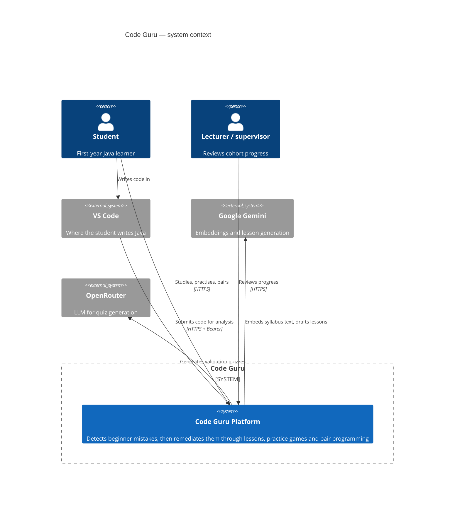
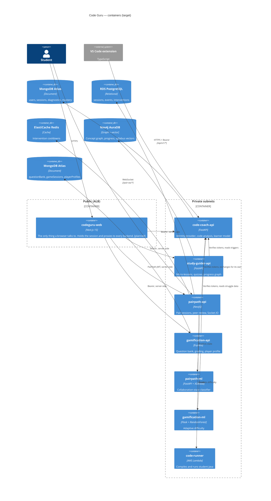

# Code Guru — Platform Architecture

> **Status:** target architecture. Component fixes are implemented; the unified
> frontend and the AWS deployment are not yet built. Anything not yet true is
> marked **[planned]**.

Code Guru is a programming-education platform for Java beginners, built as four
research components by four developers. This document describes how they fit
together, why the boundaries fall where they do, and what changes to get from
the current state to a deployable system.

Decisions are recorded separately in [`adr/`](adr/); this document describes the
result, and each section links to the decision that produced it.

---

## 1. Context



The loop the platform exists to close:

1. A student writes Java in VS Code. **Code Coach** analyses it without running
   it and returns tiered hints.
2. Repeating the same mistake raises a **remediation trigger**.
3. **Study Guider** turns that trigger into a micro-lesson and a validation quiz.
4. **Gamification** offers practice games pitched at the concept, at a
   difficulty chosen by a model.
5. **PairPath** pairs the student with a peer and watches the collaboration for
   signs of struggle.

Every step reads and writes the same learner model, which Code Coach owns.

---

## 2. Containers



### Why Code Coach is more than one component's backend

Code Coach owns three things that look separable and are not:

- **Identity.** Argon2 password hashing, HS256 access tokens valid one hour, and
  rotating refresh tokens. Sessions are revocable server-side.
- **The learner model.** Diagnostics, learning sessions, concept mastery,
  remediation triggers and the shared event log.
- **Code analysis.** Tree-sitter parsing, 52 features, 15 error types of which 5
  are ML-gated.

The other three components hold no accounts. They verify every request by
calling `GET /api/v1/auth/me` and forwarding the student's own token, which
means authorisation comes free: every `me` endpoint resolves to the token's
owner, so a service cannot read another student's data even by mistake. See
[ADR 0002](adr/0002-code-coach-remains-identity-provider.md).

This makes Code Coach a deliberate modular monolith at the centre of an
otherwise distributed system. Splitting identity from the learner model would
mean a network hop on the hot path of every request for no isolation gain,
because both are owned by the same team and deployed together.

---

## 3. The web tier **[planned]**

Today there are four frontends: three React SPAs on three bundlers across three
React versions, plus a Vite login portal. Shared code is kept in step by shell
scripts that copy `codeguru-auth.js`, `codeguru-theme.css` and `CodeGuruBar`
between four git repositories, with `diff` and `md5sum` as the only enforcement
— and PairPath's copy of the bar has to be hand-transcribed because the script
will not overwrite TypeScript with JavaScript.

Because the UIs sit on four origins, they need machinery that exists for no
other reason: URL-fragment token handoff, an open-redirect allow-list, a `/go`
service registry, three localhost-only dev-login pages behind a double gate,
CORS allow-lists on four backends, and a Vite dev proxy.

One Next.js application replaces all of it, as a **backend-for-frontend**: the
browser never holds a token or learns a backend URL. Route handlers keep the
session in an httpOnly, Secure, SameSite=Lax cookie encrypted as a JWE, and
attach the bearer token server-side.

| Removed | Replaced by |
|---|---|
| `codeguru-auth.js` × 4 + `sync-codeguru-auth.sh` | one `lib/session.ts` |
| `CodeGuruBar` × 4 + `sync-codeguru-shared.sh` | one `<PlatformShell>` |
| Fragment handoff, `VITE_ALLOWED_REDIRECTS`, `/go` | same-origin navigation |
| Three `/dev-login` pages | one login page |
| CORS lists on four backends, Vite proxy | same-origin BFF |
| Tokens in `localStorage` | httpOnly encrypted cookie |

Ten mechanisms become one. See [ADR 0001](adr/0001-one-frontend-bff.md).

**Refresh happens in middleware, not in the proxy.** Code Coach rotates refresh
tokens, so two concurrent proxied requests both refreshing would invalidate each
other and destroy the session. One choke point refreshes when the access token
is within five minutes of expiry, re-seals the cookie, and sets it on the
response.

**PairPath keeps its token exchange.** Its Socket.IO handshake verifies its own
signature and every foreign key points at a local `users.id`, so it issues its
own JWT from a Code Coach token via `POST /auth/exchange`. The BFF performs that
exchange once at login and stores both tokens in the same cookie.

---

## 4. Request path

One authenticated page load, end to end:

```
Browser ──GET /study──────────▶ codeguru-web
                                  │ middleware: unseal cookie; refresh if < 5 min left
                                  │ route handler: attach Bearer
                                  ├──GET /api/remediation/triggers──▶ study-guider-api
                                  │                                     │ verify token (60s cache)
                                  │                                     ├──GET /api/v1/auth/me──▶ code-coach-api
                                  │                                     │◀── 200 {user} ──
                                  │                                     ├──GET /api/v1/remediation/me/triggers──▶ code-coach-api
                                  │                                     └── Neo4j: progress + lesson cache
                                  │◀── triggers ──
                                  └── render
```

Three properties worth stating because they were each a bug once:

- **A `401` from `/auth/me` means reject; a timeout means `503`.** Returning a
  user when Code Coach is unreachable turns an outage into an authentication
  bypass. Every sibling service draws this distinction.
- **`me` is the only addressable student.** Routes used to take a `student_id`
  from the request body, which let anyone read anyone's progress.
- **Verification is remote, not local.** A valid signature is not a live
  session: signing out revokes server-side, and a locally-verified token would
  keep working until expiry.

---

## 5. Data

Per-service ownership, chosen on the shape of the data rather than for variety.
See [ADR 0003](adr/0003-database-per-service.md).

| Service | Store | Why |
|---|---|---|
| Code Coach | **MongoDB Atlas** **[planned]** | Currently Firestore, whose one-equality-filter rule forces aggregation in Python — every `/students/me/*` endpoint carries a `sample_size` parameter to bound it, and there is a commit named "Stop the dashboard burning the Firestore read quota". `build_storage()` already selects Mongo from env and `MongoStorage` has an identical 31-method API, so the move is one line in `requirements-prod.txt`. PostgreSQL is the honest long-term answer. |
| PairPath | **RDS PostgreSQL** + **Redis** | 17 models with real foreign keys and cascades. Redis is required behind more than one instance: cooldowns fall back to a per-process map, so students get duplicate nudges. |
| Study Guider | **Neo4j AuraDB** | Concept graph, student progress, and — since the Chroma removal — the syllabus vector index. |
| Gamification | **MongoDB Atlas** | `QuestionBank.correctAnswer` is genuinely polymorphic per game type: a number, an array, or a string. Three collections, no cross-entity transactions. |

Code Coach and Gamification share an engine on **separate clusters**, which
keeps database-per-service ownership intact.

### Neo4j earns its place

The graph was two join tables wearing graph labels: `(Student)-[:ATTEMPTED]->(Concept)`
and `(ErrorType)-[:HAS_LESSON]->(Lesson)`. Both are relational shapes.

What justifies a graph database is the learning-path query — a variable-depth
walk up the prerequisite chain, filtered at each level against the same
student's history:

```cypher
MATCH path = (prereq:Concept)-[:PREREQUISITE_OF*1..4]->(target:Concept)
WHERE target.name = $target
  AND NOT EXISTS {
    (:Student {student_id: $student_id})-[a:ATTEMPTED]->(prereq)
    WHERE a.percentage >= 50
  }
RETURN prereq.name, length(path) AS steps_away
ORDER BY steps_away
```

In SQL that is a recursive CTE re-joining the attempt table at every level, and
it still cannot return the path as a value.

Moving the syllabus vectors into Neo4j's native vector index compounds this:
retrieval and traversal became the same query, and it made the platform diagram
honest — `render_codeguru_platform.py` had described this component as doing
"Graph RAG micro-lessons" while the vector store sat outside the graph entirely.

**The prerequisite edges are not populated.** Asserting an ordering is a
pedagogical claim; deriving one from data is better and is not currently
possible. See §7.

---

## 6. Deployment **[planned]**

ECS Fargate behind a single Application Load Balancer, with exactly three
listener rules. See [ADR 0004](adr/0004-aws-ecs-alb.md).

| Rule | Target | Why public |
|---|---|---|
| `/api/v1/*` | code-coach-api | The VS Code extension is not a browser and cannot use the BFF. This is also the published integration contract. |
| `/pair-ws/*` | pairpath-api | Next.js route handlers cannot proxy a WebSocket upgrade. |
| `/*` | codeguru-web | Everything else. |

Everything else is private, reached over ECS Service Connect. Two consequences
fall out for free: Code Coach's unauthenticated `POST /analyze` and
`POST /debug-ast` sit at the **root**, not under `/api/v1`, so the path rule
leaves them unreachable from the internet with no code change; and since no
browser makes a cross-origin request, the CORS allow-lists on all four backends
can be emptied.

### Executing untrusted code

PairPath compiled and ran student Java by shelling out to `docker run` from
inside its API process. No serverless container platform provides a Docker
daemon, and mounting the host socket into the API container gives anything that
escapes the sandbox effective root on the host — PairPath's own deployment notes
name the risk.

Student code now runs in a Lambda container image. Each invocation is a
Firecracker microVM with its own kernel, destroyed afterwards, which is a
**stronger** boundary than the container it replaces — and it removes the last
reason to run EC2 anywhere in this architecture. The function is attached to a
private subnet with no NAT gateway, which is what replaces `--network none`.
See [ADR 0005](adr/0005-code-execution-isolation.md).

### Inter-service events

Code Coach's contract already designs two topics — `remediation.triggered` and
`learning-event.created` — with a transport-agnostic envelope. On AWS that maps
to EventBridge with SQS targets and deduplication on `event_id`. **Not
implemented**: services poll the equivalent REST endpoints today, and the
payload shapes are identical, so switching later costs nothing. See
[ADR 0006](adr/0006-async-events.md).

---

## 7. Known limitations

Stated because a reader will otherwise assume otherwise.

- **The prerequisite graph is empty.** The tool that would derive it
  (`code-coach/backend/app/dev_tools/derive_concept_prerequisites.py`) refuses on
  the current data, correctly: 98 diagnostics from 3 users who resolved an
  identical 13 concepts, each within a window of between 32 seconds and 3.5
  minutes. That is a seed script, and an ordering derived from it would recover
  the script's iteration order while carrying the authority of real data.
- **Models are trained on generated data.** PairPath's classifier comes from a
  simulated 200-session corpus; its own docs say "what has been validated is the
  pipeline, not detection accuracy on real students". Gamification's difficulty
  model trains on sessions produced by a seeder that derives each session's
  behaviour *from* the difficulty label, so a model fitted on it recovers that
  seeder's rules. Study Guider's cognitive-state model is fitted on roughly ten
  rows.
- **`RAGDocument` and `RAGChunk` in PairPath are unused.** The retrieval that
  runs scores curated text files by keyword. The models are either scaffolding
  or should be dropped.
- **Ethical clearance gates real participants**, and sandboxed execution must be
  confirmed active before any study.

---

## 8. Where things live

| Repository | Contents |
|---|---|
| `code-coach` | FastAPI backend, VS Code extension, `integration/` (the platform contract), `portal/` (retired by the unified frontend) |
| `Study-Guider` | FastAPI backend |
| `Pair_Path` | NestJS API, FastAPI ml-service, `code-runner-lambda/` |
| `adaptive-gamification-engine` | Express backend, Flask ml-service |
| `codeguru-web` | This document, and the unified frontend **[planned]** |

`code-coach/integration/README.md` and `API_CONTRACT.md` remain the normative
API contract between components. This document describes structure; that one
describes the wire.
